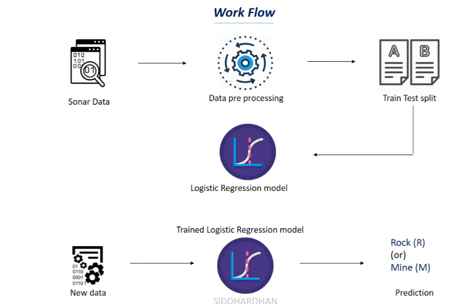

# 🪨 Rock vs Mine Detection — Sonar Data Classification

## 📌 Project Overview
A machine learning project that classifies underwater objects as **rocks or mines** using sonar signal data. The model is trained on the UCI Sonar dataset and uses logistic regression to distinguish between the two classes based on frequency response patterns.

## 🔄 Workflow

<p align="center">
  
</p>

| Step | Description |
|------|-------------|
| 📥 Data Collection | Sonar dataset containing 208 samples and 60 frequency features |
| 🧹 Understand data | mean, std, balance, shape, missing values |
| ✂️ Data Splitting  | Dividing data into training and testing sets (90/10 split) |
| 🤖 Model Training  | Logistic Regression model trained on sonar features |
| 📊 Evaluation      | Measuring accuracy, precision, recall, and confusion matrix |

## 🛠️ Tech Stack


## 📁 Project Structure
```
├── sonar_data.csv (data file)
├── model.ipynb    (model code)
├── workflow.png
└── README.md      (project decription)
```

## 📈 Results
| Metric | Score |
|--------|-------|
| Training Accuracy | 83.4% |
| Testing Accuracy  | 76% |