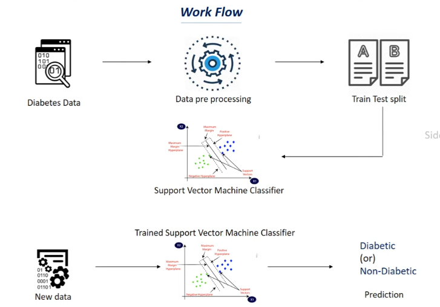

# 🩺 Diabetes Prediction — Classification Using SVM

## 📌 Project Overview
A machine learning project that predicts whether a patient is **diabetic or not** based on medical diagnostic data. The model is trained on the Pima Indians Diabetes dataset using a **Support Vector Machine (SVM)** classifier.

---

## 🔄 Workflow

<p align="center">
  
</p>

| Step | Description |
|------|-------------|
| 📥 Data Collection | Diabetes dataset containing 768 samples and 8 medical features |
| 🧹 Understand Data | Mean, std, balance, shape, missing values |
| ✂️ Data Splitting  | Dividing data into training and testing sets (80/20 split) |
| 🤖 Model Training  | SVM classifier trained on patient medical features |
| 📊 Evaluation      | Measuring accuracy, precision, recall, and confusion matrix |

---

## 🛠️ Tech Stack


---

## 🧠 How SVM Works

<p align="center">
  
</p>

### Step 1 — Plot the Data
Each patient is represented as a point in space based on their medical features:
```
x-axis → feature 1 (e.g. glucose level)
y-axis → feature 2 (e.g. BMI)
```

### Step 2 — Find the Hyperplane
SVM finds the **best line (or hyperplane)** that separates diabetic from non-diabetic patients:
```
Class 1: Diabetic    →  one side of the hyperplane
Class 0: No Diabetes →  other side of the hyperplane
```

### Step 3 — Maximize the Margin
SVM doesn't just find any line — it finds the one with the **largest margin** between both classes:
```
margin = distance between hyperplane and nearest points (support vectors)

Larger margin → better generalization → better predictions ✅
```

### Step 4 — Decision
```
point on positive side  →  Diabetic 🔴
point on negative side  →  Not Diabetic 🟢
```

### Step 5 — Learning
```
Find support vectors (closest points to hyperplane)
      ↓
Maximize the margin between classes
      ↓
Optimal hyperplane found ✅
      ↓
Evaluate with Accuracy Score
```

---

## 📁 Project Structure
```
├── diabetes.csv    (data file)
├── model.ipynb     (model code)
├── svm.png
└── README.md       (project description)
```

---

## 📈 Results
| Metric | Score |
|--------|-------|
| Training Accuracy | XX% |
| Testing Accuracy  | XX% |