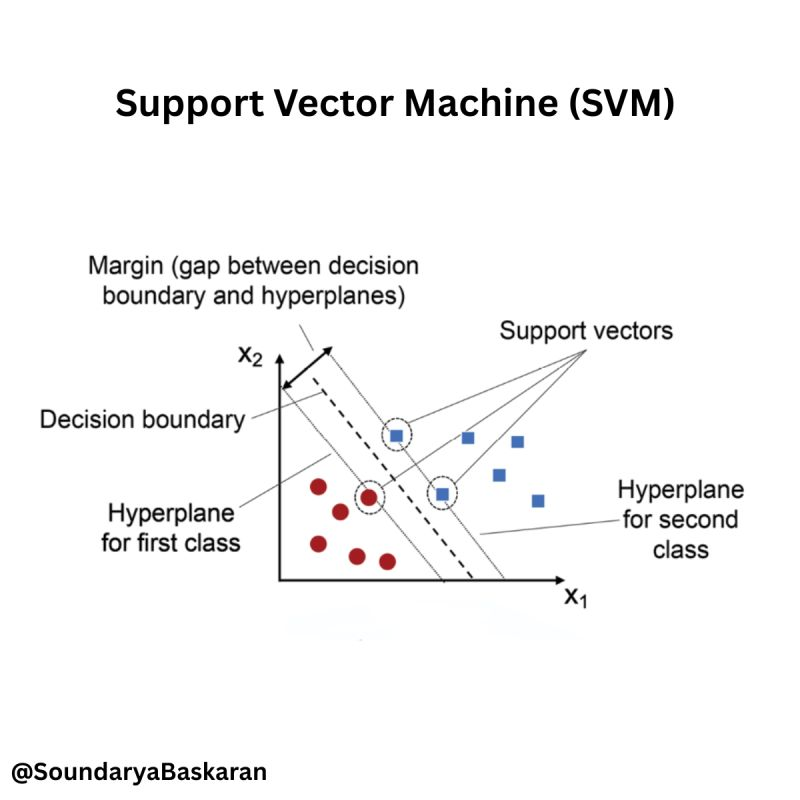

# 🩺 Diabetes Prediction — Classification Using SVM

## 📌 Project Overview
A machine learning project that predicts whether a patient is **diabetic or not** based on medical diagnostic data. The model is trained on the Pima Indians Diabetes dataset using a **Support Vector Machine (SVM)** classifier with a linear kernel.

---

## 🔄 Workflow

<p align="center">
  
</p>

| Step | Description |
|------|-------------|
| 📥 Data Collection | Diabetes dataset containing 768 samples and 9 columns (8 features + 1 label) |
| 🧹 Understand Data | Checked mean, std, class balance, shape, and missing values |
| ⚖️ Standardization | Applied StandardScaler to normalize all 8 features |
| ✂️ Data Splitting  | Divided data into training and testing sets (80/20 split) |
| 🤖 Model Training  | SVM classifier with linear kernel trained on standardized features |
| 📊 Evaluation      | Measured training & testing accuracy|
| 🔮 Prediction      | Predicts diabetic or not for a new patient input |

---

## 🛠️ Tech Stack


---

## 🧠 How SVM Works

<p align="center">
  
</p>

### Step 1 — Find the Hyperplane
SVM finds the **best line (or hyperplane)** that separates diabetic from non-diabetic patients:
```
Class 1: Diabetic    →  one side of the hyperplane
Class 0: No Diabetes →  other side of the hyperplane
```

### Step 2 — Maximize the Margin
SVM finds the hyperplane with the **largest margin** between both classes:
```
margin = distance between hyperplane and nearest points (support vectors)

Larger margin → better generalization → better predictions ✅
```

### Step 3 — Decision
```
point on positive side  →  Diabetic 🔴
point on negative side  →  Not Diabetic 🟢
```

---

## ⚠️ Why Standardization Matters

SVM is sensitive to feature scale. Without standardization, features with large ranges dominate the model:

```
Glucose  →  0 to 200   ← dominates without scaling ❌
BMI      →  0 to 50
```

After `StandardScaler` all features are on the same scale ✅

> **Important:** Use `scaler.transform()` on new inputs — NOT `fit_transform()` — to apply the same scale learned during training.

---

## 📁 Project Structure
```
├── diabetes_data.csv   (data file)
├── model.ipynb         (model code)
├── svm.png
└── README.md           (project description)
```
---

## 📈 Results

| Metric | Score |
|--------|-------|
| Training Accuracy | 78% |
| Testing Accuracy  | 77.9% |
