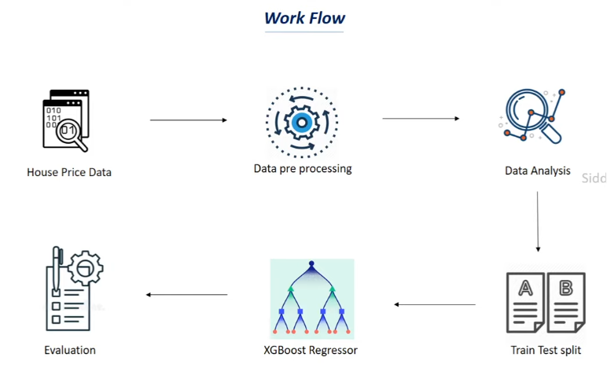
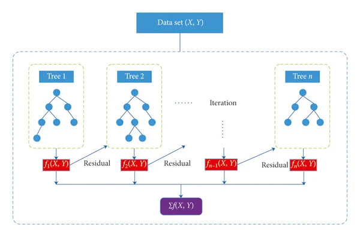

# 🏠 California Housing Price Prediction — XGBoost Regression

## 📌 Project Overview
A machine learning project that predicts **California house prices** based on demographic and geographic features. The model is trained on the California Housing dataset using **XGBoost Regressor** — one of the most powerful gradient boosting algorithms.

---

## 🔄 Workflow

<p align="center">
  
</p>

| Step | Description |
|------|-------------|
| 📥 Data Collection | California Housing dataset — 20,640 samples and 8 features |
| 🧹 Understand Data | Checked shape, missing values, statistics, and feature correlation |
| 🔥 Correlation Heatmap | Visualized positive and negative correlations between features |
| ✂️ Data Splitting | Divided data into training and testing sets (80/20 split) |
| 🤖 Model Training | XGBoost Regressor trained on housing features |
| 📊 Evaluation | Measured R² Score and MAE on both training and testing data |
| 📈 Visualization | Scatter plot of actual vs predicted prices |
| 🔮 Prediction | Predicts house price for a new input sample |

---

## 🛠️ Tech Stack


---

## 🧠 How XGBoost Works
<p align="center">
  
</p>

### Core Idea — Sequential Trees
XGBoost builds many decision trees **one after another**, where each tree learns from the mistakes of the previous one:

```
Tree 1  →  makes predictions, has some errors
Tree 2  →  focuses on errors of Tree 1
Tree 3  →  focuses on errors of Tree 2
  ↓
Final   →  combination of all trees → accurate prediction ✅
```

### Learning Loop
```
Make Prediction
      ↓
Calculate Error (Loss Function)   ← how wrong am I?
      ↓
Gradient Descent                  ← find direction to improve
      ↓
Next tree fixes remaining errors
      ↓
Repeat until error is minimal ✅
```

---

## 📊 Evaluation Metrics

### R² Score
Measures how well the model explains the data patterns:
```
R² = 1.00  →  perfect model 🎯
R² = 0.94  →  excellent ✅
R² = 0.00  →  model learned nothing ❌
```

### MAE (Mean Absolute Error)
Measures how far off predictions are on average:
```
MAE close to 0  →  very accurate ✅
MAE very large  →  predictions are far off ❌
```

---

## 📁 Project Structure
```
├── model.ipynb     (model code)
├── workflow.png
└── README.md       (project description)
```

---


## 📈 Results

| Metric | Testing |
|--------|---------|
| R² Score |0.83|
| MAE |0.30|
