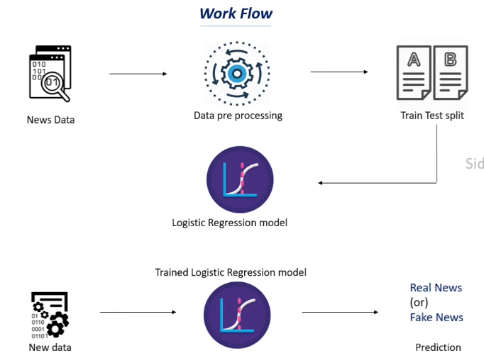

# 📰 Fake News Detection — NLP Classification

## 📌 Project Overview
A Natural Language Processing (NLP) project that classifies news articles as **Real or Fake** based on the article's author and title. The model is trained using **TF-IDF Vectorization** and **Logistic Regression**

---

## 🔄 Workflow

<p align="center">
  
</p>

| Step | Description |
|------|-------------|
| 📥 Data Collection | News dataset containing real and fake articles with author and title |
| 🧹 Understand Data | Checked shape, missing values, and class balance |
| 🔧 Preprocessing | Filled missing values, merged author and title into one content column |
| ✂️ Text Cleaning | Removed symbols, lowercased, removed stopwords, and applied stemming |
| 🔢 Vectorization | Converted text to numbers using TF-IDF Vectorizer |
| ✂️ Data Splitting | Divided data into training and testing sets (80/20 split) |
| 🤖 Model Training | Logistic Regression trained on TF-IDF features |
| 📊 Evaluation | Measured training and testing accuracy |
| 🔮 Prediction | Predicts Real or Fake for a new article |

---

## 🛠️ Tech Stack


---

## 🧠 NLP Pipeline

### Step 1 — Text Cleaning
```
Raw Text → "The Actors are Acting in a Theatrical Performance!!!"
              ↓ remove symbols    (re)
           "The Actors are Acting in a Theatrical Performance   "
              ↓ lowercase
           "the actors are acting in a theatrical performance"
              ↓ split into words
           ["the", "actors", "are", "acting", "in", "a", "theatrical", "performance"]
              ↓ remove stopwords + stem
           ["actor", "act", "theatric", "perform"]
              ↓ join back
Output  → "actor act theatric perform"
```

### Step 2 — TF-IDF Vectorization
Converts cleaned text into numbers the model can understand:
```
"election president virus"  →  [0.45, 0.62, 0.31, 0.00, ...]
```

| Term | Meaning |
|------|---------|
| TF (Term Frequency) | How often a word appears in one article |
| IDF (Inverse Document Frequency) | How rare the word is across all articles |
| TF-IDF | Common words get low score, important words get high score ✅ |

### Step 3 — Classification
```
TF-IDF numbers → Logistic Regression → 0 (Real) or 1 (Fake)
```

---

## ⚙️ Key Preprocessing Steps

### Handling Missing Values
```python
data = data.fillna('')   # replace NaN with empty string
```

### Merging Author + Title
```python
data['content'] = data['author'] + " " + data['title']
```

### Stemming Function
Reduces words to their root form:
```
"running" → "run"
"actors"  → "actor"
"loved"   → "love"
```

---

## 📁 Project Structure
```
├── data.csv          (dataset)
├── model.ipynb       (model code)
├── workflow.png
└── README.md         (project description)
```

---


## 📈 Results

| Metric | Score |
|--------|-------|
| Training Accuracy | 98% |
| Testing Accuracy  | 97% |