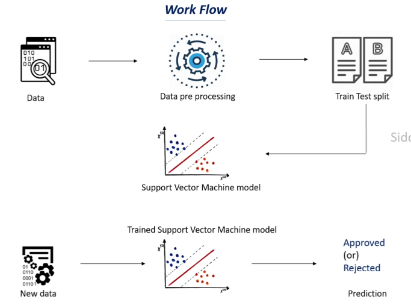

# 🏦 Loan Prediction — Classification Using SVM

## 📌 Project Overview
A machine learning project that predicts whether a loan application will be **approved or rejected** based on applicant information. The model is trained on a loan dataset using a **Support Vector Machine (SVM)** classifier with a linear kernel.

---

## 🔄 Workflow

<p align="center">
  
</p>

| Step | Description |
|------|-------------|
| 📥 Data Collection | Loan dataset containing 614 samples and 13 columns |
| 🧹 Understand Data | Checked shape, statistics, missing values|
| 🔧 Missing Values | Filled categorical columns with mode, numerical columns with median |
| 🔢 Encoding | Converted categorical features to numerical using map() with astype(int) |
| ✂️ Data Splitting | Divided data into training and testing sets (90/10 split) |
| 🤖 Model Training | SVM classifier with linear kernel |
| 📊 Evaluation | Measured training and testing accuracy |
| 🔮 Prediction | Predicts loan approval for a new applicant |

---

## 🛠️ Tech Stack


---

## 📁 Project Structure
```
├── data.csv          (dataset)
├── model.ipynb       (model code)
├── workflow.png
└── README.md         (project description)
```

## 📈 Results

| Metric | Score |
|--------|-------|
| Training Accuracy | 81.5% |
| Testing Accuracy  | 80.6% |