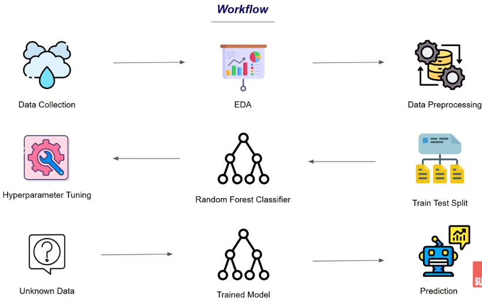

# 🌧️ Rainfall Prediction — Classification Using Random Forest

## 📌 Project Overview
A machine learning project that predicts whether it will **rain or not** based on weather measurements. The model is trained on a weather dataset using a **Random Forest Classifier** with hyperparameter tuning via **GridSearchCV** and saved using **Pickle** for reuse.

---

## 🔄 Workflow

<p align="center">
  
</p>

| Step | Description |
|------|-------------|
| 📥 Data Collection | Weather dataset with features like pressure, temperature, humidity, wind |
| 🧹 Understand Data | Checked shape, info, missing values, and class balance |
| 🔧 Preprocessing | Removed extra spaces, dropped `day` column, handled missing values |
| 📊 EDA | Distribution plots, countplot, correlation heatmap, boxplots |
| 🔢 Encoding | Converted `rainfall` column — yes→1, no→0 |
| ⚖️ Handle Imbalance | Downsampling majority class to match minority class |
| 🗑️ Drop Correlated | Dropped `mintemp`, `maxtemp`, `temparature` (multicollinearity) |
| ✂️ Data Splitting | Divided data into training and testing sets (80/20 split) |
| 🤖 Model Training | Random Forest with GridSearchCV hyperparameter tuning |
| 📊 Evaluation | Cross Validation, accuracy, classification report, confusion matrix |
| 💾 Save Model | Saved best model using Pickle for deployment |
| 🔮 Prediction | Predicts rain or no rain for new weather input |

---

## 🛠️ Tech Stack


---

## 🧠 How Random Forest Works

### Core Idea — Parallel Trees
Random Forest builds many decision trees **independently** and combines their votes:

```
Data
 ├──→ Tree 1  →  Rain ✅
 ├──→ Tree 2  →  No Rain
 ├──→ Tree 3  →  Rain ✅
 └──→ Tree N  →  Rain ✅
           ↓
      Majority Vote
           ↓
        Rain 🌧️ ✅
```

### Why Random Forest over a Single Tree?
```
Single Decision Tree  →  overfits easily ❌
Random Forest         →  many trees vote → more stable, less overfitting ✅
```

---


## 📁 Project Structure
```
├── data.csv                        (dataset)
├── model.ipynb                     (model code)
├── rainfall_prediction_model.pkl   (saved model)
├── workflow.png
└── README.md                       (project description)
```

---


## 📈 Results

| Metric | Score |
|--------|-------|
| Cross Validation Mean | 81.8% |
| Test Accuracy | 74.4% |
