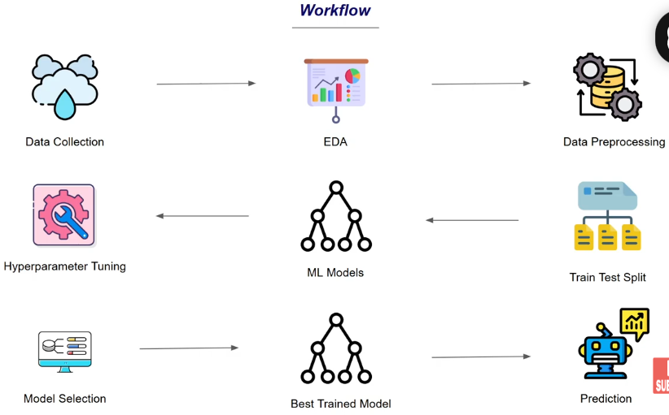

# 🧠 Autism Spectrum Disorder (ASD) Screening — Classification Using Random Forest

## 📌 Project Overview
A machine learning project that predicts whether a person is likely to have **Autism Spectrum Disorder (ASD)** based on behavioral and demographic features. The model is trained on an ASD screening dataset using **3 models** with hyperparameter tuning via **RandomizedSearchCV**, class imbalance handling via **SMOTE**, and saved using **Pickle** for deployment.

---

## 🔄 Workflow

<p align="center">
  
</p>

| Step | Description |
|------|-------------|
| 📥 Data Collection | ASD screening dataset with behavioral and demographic features |
| 🧹 Understand Data | Checked shape, missing values, unique values, and class balance |
| 🔧 Preprocessing | Dropped ID & age_desc, converted age to int, fixed country names |
| 📊 EDA | Histograms with mean/median lines, boxplots, countplot, heatmap |
| 🔍 Outlier Handling | IQR method to detect + clip/cap to handle age outliers |
| 🔤 Encoding | Label Encoding for all object columns with saved encoders |
| ✂️ Data Splitting | Divided data into training and testing sets (80/20 split) |
| ⚖️ Handle Imbalance | SMOTE applied on training data only to balance classes |
| 🤖 Model Training | 3 models compared — Decision Tree, Random Forest, XGBoost |
| 🔧 Hyperparameter Tuning | RandomizedSearchCV with 25 iterations and 5-fold CV |
| 📊 Evaluation | CV scores, accuracy, classification report, confusion matrix, ROC curve |
| 💾 Save Model | Saved best model and encoders using Pickle |
| 🔮 Prediction | Predicts ASD likelihood for a new patient input |

---

## 🛠️ Tech Stack


---

## 🧠 Models Compared

| Model | CV Score |
|-------|---------|
| Decision Tree | 0.86 |
| **Random Forest** | **0.91 🏆** |
| XGBoost | 0.90 |

**Winner: Random Forest** with best params:
```
n_estimators     = 400
max_depth        = 30
max_features     = sqrt
min_samples_leaf = 2
bootstrap        = False
```


---

## 📁 Project Structure
```
├── data.csv                  (dataset)
├── model.ipynb               (model code)
├── autism_model.pkl          (saved best model)
├── encoder.pkl               (saved label encoders)
├── workflow.png
└── README.md                 (project description)
```

---


## 📈 Results

| Metric | Decision Tree | Random Forest | XGBoost |
|--------|--------------|---------------|---------|
| CV Score | 0.86 | 0.91 | 0.90 |
| Test Accuracy | 78% | 84% | 79% |
| AUC Score | 0.68 | 0.89 | 0.86 |